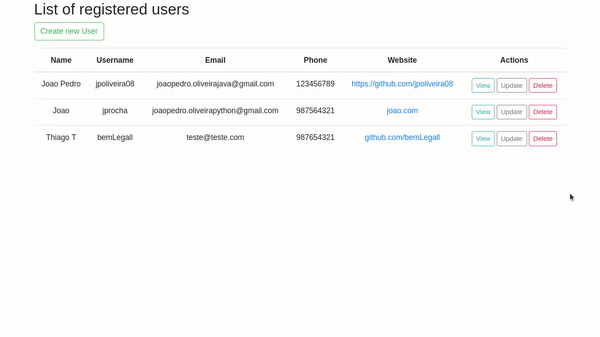

<h1 align="center"><b>Simple CRUD project in PHP working with JSON and MVC</b></h1>

<h2 align="justify"><b>Motivation</b></h2>

The idea behind this project is trying to apply some concepts about PHP in a CRUD (Create, Read, Update, and Delete) also implement the project with a simple MVC  (Model, View, and Controller) pattern.

 

<h2 align="justify"><b>Tech/framework used</b></h2>

Built with:

<ul>
<li> PHP </li>
<li> Composer (just for autoload) </li>
<li> HTML </li>
<li> BootStrap </li>
</ul>

 

<h2 align="justify"><b>Features</b></h2>

- [x] Create the user
- [x] View the user
- [x] Update the user
- [x] Delete the user
- [x] Form validations (Name, Username, Email, Phone)

 

<h2 align="justify"><b>Description</b></h2>

In the index.php I have implemented a simple route system, that's a front controller, which will handle all requests for this simple application.

 

To implement the MVC, I have separated the project in some folders, inside the app we have the Controller and the Models (Model), and in the root we have the folder public that's represent the View.

<h3><b>Model</b></h3>

In this folder, we have a class that's corresponds to the data user and the JSON file. Here we have all the business logic, in another word's the Controller will send data already validate, and then we'll be adding/update or delete from the JSON file also we can return data from the JSON.

<b>Creating a User</b>

<b>Updating and deleting a User</b>

<h3><b>Controller</b></h3>

Here we will have the Controller and the UserController that's extends the Controller, this separation was made because in one side, we send information to a view and other we have to read or send data to the Model. The Controller is responsible for controlling the application logic and acts as the coordinator between the View and the Model. Here we can do some validations in the input of the form, how we can see below.

<h3><b>View</b></h3>

In this part we will hhave the user interface, in another words, is responsible for rendering the contents in the user's browser and the pages that he will interact with, like a table of users registered or a page of user not found how we can see below.

 
<h2 align="justify"><b>Final Result</b></h2>

Here we have the final result of the project and how data is stored in JSON file.

<h2 align="justify"><b>Credits</b></h2>

Here we have a combination of two principal fonts that used to develop this project

PHP::CRUD COM MVC - https://alexandrebbarbosa.wordpress.com/2018/06/28/phpcrud-com-mvc/

Simple CRUD application with PHP and JSON (Codeholic) - https://www.youtube.com/watch?v=DWHZSkn5paQ

